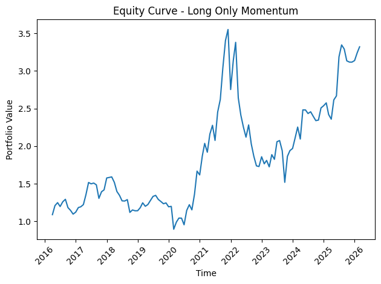
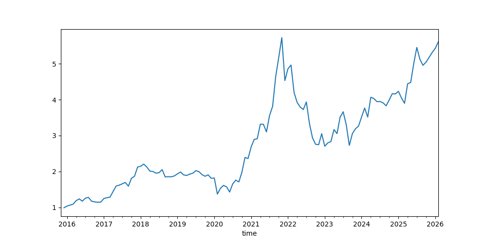
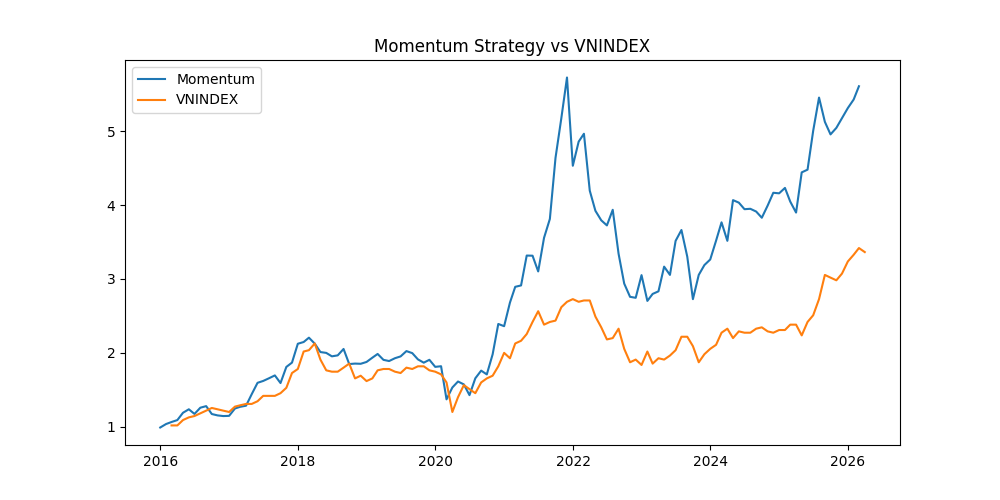
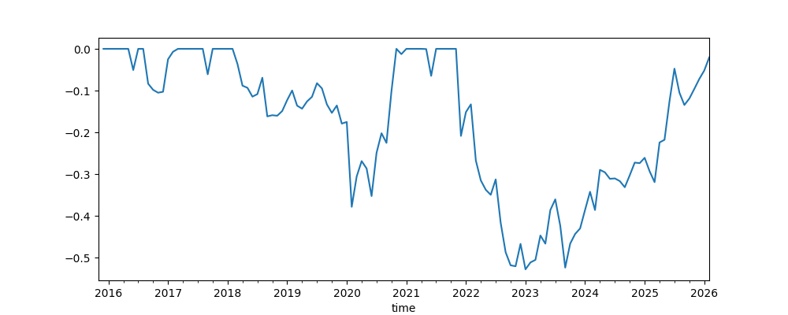
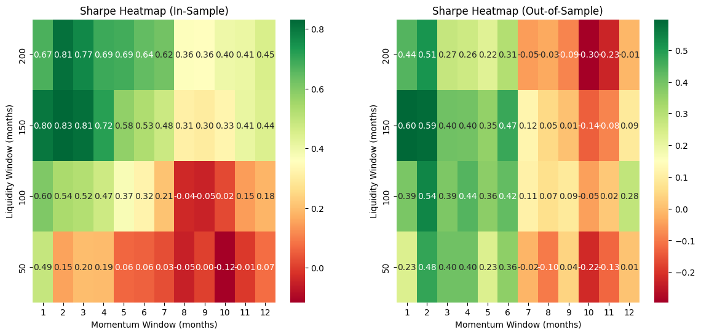

# Vietnam Equity Momentum Strategy

## Overview

This project implements a **cross-sectional momentum strategy** on the Vietnamese equity market.

Momentum is a widely documented anomaly in quantitative finance where assets that performed well in the past tend to continue outperforming in the near future.

The objective of this research is to:

* Investigate the presence of the **momentum effect in Vietnam equities**
* Evaluate the performance of a systematic momentum strategy
* Analyze robustness through parameter sensitivity and backtesting

---

## Strategy Methodology

The strategy follows a typical **cross-sectional momentum framework** used in quantitative asset management.

### 1. Universe Selection

Stocks are filtered by liquidity to ensure tradability.

* Liquidity proxy: **Average Dollar Volume**
* Universe: **Top liquid stocks in the market**

---

### 2. Momentum Signal

Momentum is computed as the past **N-month cumulative return**:

Momentum = P(t) / P(t−N) − 1

where:

* P(t) is the current price
* N is the lookback window

Momentum windows between **3 and 12 months** are explored.

---

### 3. Portfolio Construction

At each rebalance date:

1. Rank stocks by momentum
2. Select the **top performers**
3. Build an **equal-weighted portfolio**

---

### 4. Rebalancing

The portfolio is **rebalanced monthly**.

At each rebalance:

* signals are recalculated
* stocks are re-ranked
* portfolio weights are updated

---

## Backtest Results

### Strategy Equity Curve



After additional filtering and adjustments:



---

### Strategy vs Market Benchmark

Comparison with the VNINDEX benchmark:



---

### Drawdown Analysis



---

### Parameter Sensitivity

Performance across different momentum windows and portfolio selections:



---

## Repository Structure

```
vn-momentum-strategy
│
├── data
│   ├── VNINDEX.parquet
│   ├── price.parquet
│   └── volume.parquet
│
├── figures
│   ├── Drawdown_alter.png
│   ├── Equity_Curve_alter.png
│   ├── Equity_Curve_raw.png
│   ├── HeatMap.png
│   └── Vs_VNINDEX.png
│
├── notebooks
│   └── momentum_backtest.ipynb
│
├── src
│   └── strategy.py

├── .gitignore
│
└── README.md
```

---

## Implementation

The main research workflow is implemented in:

```
notebooks/momentum_backtest.ipynb
```

The notebook contains:

* data preprocessing
* momentum signal construction
* portfolio formation
* performance evaluation
* visualization

---

## Future Improvements

Possible extensions for further research:

* transaction cost modeling
* turnover analysis
* weekly rebalancing strategies
* risk factor exposure analysis
* multi-factor models (momentum + value + size)

---

## Disclaimer

This project is for **research and educational purposes only** and does not constitute investment advice.
